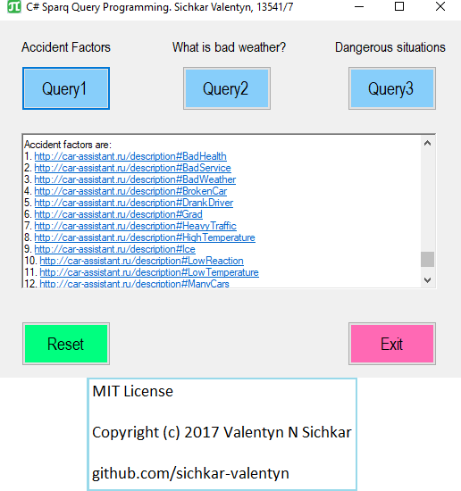

# Sparql query using C#
Sparql query programming using C#

### Reference to:
[1] Valentyn N Sichkar. Sparql query programming using C# // GitHub platform [Electronic resource]. URL: https://github.com/sichkar-valentyn/Sparql_query_using_C_Sharp (date of access: XX.XX.XXXX)

## Description
Using DotNetRDF library and C# Windows form application, the program Queries the Knowledge Base for three questions: Accident Factors, What is the bad weather, What are the dengerous situation.

Knowledge Base is represented in Notation-3 form and allows to use library to send query through it. Query looks through triples in the Knowledge Base in order to find the matched one and extract Knowledge from it.

## Program Interface

## For the query - Accident Factors

## For the query - What is the bad weather

## For the query - Dangerous situations

## MIT License
## Copyright (c) 2017 Valentyn N Sichkar
## github.com/sichkar-valentyn
## Reference to:
[1] Valentyn N Sichkar. Sparql query programming using C# // GitHub platform [Electronic resource]. URL: https://github.com/sichkar-valentyn/Sparql_query_using_C_Sharp (date of access: XX.XX.XXXX)
